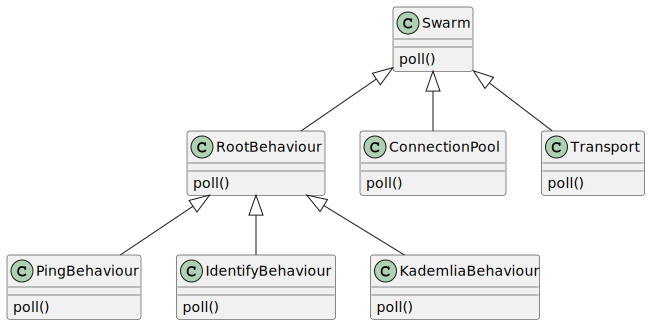

# Coding Guidelines

<!-- markdown-toc start - Don't edit this section. Run M-x markdown-toc-refresh-toc -->
**Table of Contents**

- [Coding Guidelines](#coding-guidelines)
    - [Hierarchical State Machines](#hierarchical-state-machines)
        - [Conventions for `poll` implementations](#conventions-for-poll-implementations)
        - [Prioritize local work over new work from a remote](#prioritize-local-work-over-new-work-from-a-remote)
    - [Bound everything](#bound-everything)
        - [Channels](#channels)
        - [Local queues](#local-queues)
        - [Tasks](#tasks)
        - [Further reading](#further-reading)
    - [No premature optimizations](#no-premature-optimizations)
    - [Keep things sequential unless proven to be slow](#keep-things-sequential-unless-proven-to-be-slow)
    - [Use `async/await` for sequential execution only](#use-asyncawait-for-sequential-execution-only)
    - [Don't communicate by sharing memory; share memory by communicating.](#dont-communicate-by-sharing-memory-share-memory-by-communicating)
        - [Further Reading](#further-reading)
    - [Use iteration not recursion](#use-iteration-not-recursion)
        - [Further Reading](#further-reading-1)

<!-- markdown-toc end -->


Below is a set of coding guidelines followed across the rust-libp2p code base.

## Hierarchical State Machines

If you sqint, rust-libp2p is just a big hierarchy of [state
machines](https://en.wikipedia.org/wiki/Finite-state_machine) where parents pass
events down to their children and children pass events up to their parents.



<details>
    <summary>Reproduce diagram</summary>

    ```
    @startuml
    Swarm <|-- RootBehaviour
    Swarm <|-- ConnectionPool
    Swarm <|-- Transport
    RootBehaviour <|-- PingBehaviour
    RootBehaviour <|-- IdentifyBehaviour
    RootBehaviour <|-- KademliaBehaviour

    Swarm : poll()
    RootBehaviour : poll()
    ConnectionPool : poll()
    Transport : poll()
    PingBehaviour : poll()
    IdentifyBehaviour : poll()
    KademliaBehaviour : poll()
    @enduml
    ```
</details>

Using hierarchical state machines is a deliberate choice throughout the
rust-libp2p code base. It makes reasoning about control and data flow simple. It
works well with Rust's `Future` model. It allows fine-grain control e.g. on the
order child state machines are polled.

The above comes with downsides. It feels more verbose. The mix of control flow (`loop`, `return`,
`break`, `continue`) in `poll` functions together with the asynchronous and thus decoupled
communication via events can be very hard to understand. Both are a form of complexity that we are
trading for correctness and performance which aligns with Rust's and rust-libp2p's goals.

The architecture pattern of hierarchical state machines should be used wherever possible.

### Conventions for `poll` implementations

The `poll` method of a single state machine can be complex especially when that
state machine itself `poll`s many child state machines. The patterns shown below
have proven useful and should be followed across the code base.

``` rust
fn poll(self: Pin<&mut Self>, cx: &mut Context<'_>) -> Poll<Self::Output>{
  loop {
    match self.child_1.poll(cx) {
      // The child made progress.
      Poll::Ready(_) => {
        // Either return an event to the parent:
        return Poll::Ready(todo!());
        // or `continue`, thus polling `child_1` again. `child_1` can potentially make more progress. Try to exhaust
        // it before moving on to the next child.
        continue
        // but NEVER move to the next child if the current child made progress. Given
        // that the current child might be able to make more progress, it did not yet
        // register the waker in order for the root task to be woken up later on. Moving
        // on to the next child might result in the larger `Future` task to stall as it
        // assumes that there is no more progress to be made.
      }

      // The child did not make progress. It has registered the waker for a
      // later wake up. Proceed with the other children.
      Poll::Pending(_) => {}
    }

    match self.child_2.poll(cx) {
      Poll::Ready(child_2_event) => {
        // Events can be dispatched from one child to the other.
        self.child_1.handle_event(child_2_event);

        // Either `continue` thus polling `child_1` again, or `return Poll::Ready` with a result to the parent.
        todo!()
      }
      Poll::Pending(_) => {}
    }

    match self.child_3.poll(cx) {
      Poll::Ready(__) => {
        // Either `continue` thus polling `child_1` again, or `return Poll::Ready` with a result to the parent.
        todo!()
      }
      Poll::Pending(_) => {}
    }

    // None of the child state machines can make any more progress. Each registered
    // the waker in order for the root `Future` task to be woken up again.
    return Poll::Pending
  }
}
```

### Prioritize local work over new work from a remote

When handling multiple work streams, prioritize local work items over
accepting new work items from a remote. Take the following state machine as an
example, reading and writing from a socket, returning result to its parent:

``` rust
struct SomeStateMachine {
  socket: Socket,
  events_to_return_to_parent: VecDeque<Event>,
  messages_to_send_on_socket: VecDeque<Message>,
}

impl Stream for SomeStateMachine {
  type Item = Event;

  fn poll_next(mut self: Pin<&mut Self>, cx: &mut Context<'_>) -> Poll<Option<Self::Item>> {
    loop {
      // First priority is returning local finished work.
      if let Some(event) = events_to_return_to_parent.pop_front() {
        return Poll::Ready(Some(event));
      }

      // Second priority is finishing local work, i.e. sending on the socket.
      if let Poll::Ready(()) = socket.poll_ready(cx) {
        todo!("Send messages")
        continue // Go back to the top. One might be able to send more.
      }

      // Last priority is accepting new work, i.e. reading from the socket.
      if let Poll::Ready(work_item) = socket.poll_next(cx) {
        todo!("Start work on new item")
        continue // Go back to the top. There might be more progress to be made.
      }

      // At this point in time, there is no more progress to be made. Return
      // `Pending` and be woken up later.
      return Poll::Pending;
    }
  }
}
```

This priotization provides:
- Low memory footprint as local queues (here `events_to_return_to_parent`) stay small.
- Low latency as accepted local work is not stuck in queues.
- DOS defense as a remote does not control the size of the local queue, nor starves local work with its remote work.

## Bound everything

The concept of unboundedness is an illusion. Use bounded mechanisms to prevent
unbounded memory growth and high latencies.

### Channels

When using channels (e.g. `futures::channel::mpsc` or `std::sync::mpsc`)
always use the bounded variant, never use the unbounded variant. When using a
bounded channel, a slow consumer eventually slows down a fast producer once
the channel bound is reached, ideally granting the slow consumer more system
resources e.g. CPU time, keeping queues small and thus latencies low. When
using an unbounded channel a fast producer continues being a fast producer,
growing the channel buffer indefinitely, increasing latency until the illusion
of unboundedness breaks and the system runs out of memory.

One may use an unbounded channel if one enforces backpressure through an
out-of-band mechanism, e.g. the consumer granting the producer send-tokens
through a side-channel.

### Local queues

As for channels shared across potentially concurrent actors (e.g. future tasks
or OS threads), the same applies for queues owned by a single actor only. E.g.
reading events from a socket into a `Vec<Event>` without some mechanism
bounding the size of that `Vec<Event>` again can lead to unbounded memory
growth and high latencies.

Note that rust-libp2p fails at this guideline, i.e. still has many unbounded
local queues.

### Tasks

Bound the number of
[tasks](https://docs.rs/futures/latest/futures/task/index.html) being spawned.
As an example, say we spawn one task per incoming request received from a
socket. If the number of pending requests is not bounded by some limit, a
misbehaving or malicious remote peer can send requests at a higher rate than the
local node can respond at. This results in unbounded growth in the number of
requests, and thus unbounded growth in the number of tasks and used memory.

Simply put, rust-libp2p spawns one task per connection but limits the overall
number of connections, thus adhering to this guideline.

### Further reading

- https://en.wikipedia.org/wiki/Bufferbloat
- https://apenwarr.ca/log/20170814
- https://twitter.com/peterbourgon/status/1212800031406739456

## No premature optimizations

Optimizations that add complexity need to be accompanied with a proof of their
effectiveness.

This as well applies to increasing buffer or channel sizes, as the downside of
such pseudo optimizations is increased memory footprint and latency.

## Keep things sequential unless proven to be slow

Concurrency adds complexity. Concurrency adds overhead due to synchronization.
Thus unless proven to be a bottleneck, don't make things concurrent. As an example
the hierarchical `NetworkBehaviour` state machine runs sequentially. It is easy
to debug as it runs sequentially. Thus far there has been no proof that
shows a speed up when running it concurrently.

## Use `async/await` for sequential execution only

Using `async/await` for sequential execution makes things significantly simpler.
Though unfortunately using `async/await` does not allow accesing methods on the
object being `await`ed unless paired with some synchronization mechanism like an
`Arc<Mutex<_>>`.

Example: Read and once done write from/to a socket. Use `async/await`.

``` rust
socket.read_exact(&mut read_buf).await;
socket.write(&write_buf).await;
```

Example: Read and concurrently write from/to a socket. Use `poll`.

``` rust
loop {
    match socket.poll_read(cx, &mut read_buf) {
        Poll::Ready(_) => {
            todo!();
            continue;
        }
        Poll::Pending => {}
    }
    match socket.poll_write(cx, &write_buf) {
        Poll::Ready(_) => {
            todo!();
            continue;
        }
        Poll::Pending => {}
    }

    return Poll::Pending;
}
```

When providing `async` methods, make it explicit whether it is safe to cancel
the resulting `Future`, i.e. whether it is safe to drop the `Future` returned
by the `async` method.

## Don't communicate by sharing memory; share memory by communicating.

The majority of rust-libp2p's code base follows the above Golang philosophy,
e.g. using channels instead of mutexes. This pattern enforces single ownership
over data, which works well with Rust's ownership model and makes reasoning
about data flow easier.

### Further Reading

- https://go.dev/blog/codelab-share

## Use iteration not recursion

Rust does not support tail call optimization, thus using recursion may grow the
stack potentially unboundedly. Instead use iteration e.g. via `loop` or `for`.

### Further Reading

- https://en.wikipedia.org/wiki/Tail_call
- https://stackoverflow.com/questions/65948553/why-is-recursion-not-suggested-in-rust
- https://stackoverflow.com/questions/59257543/when-is-tail-recursion-guaranteed-in-rust
